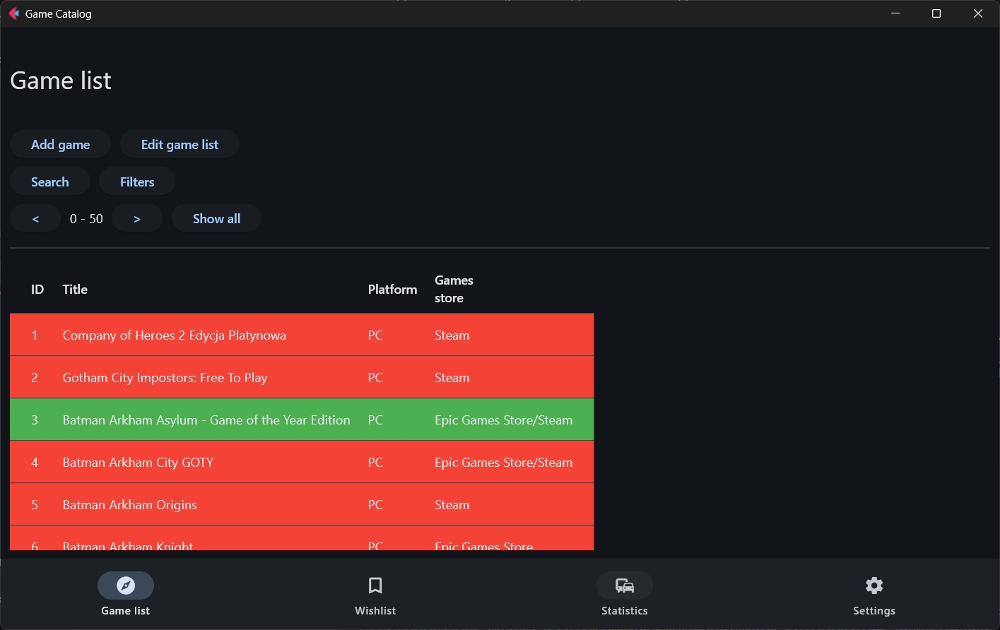
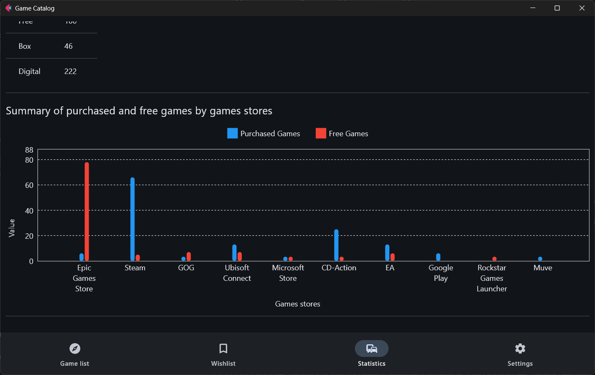
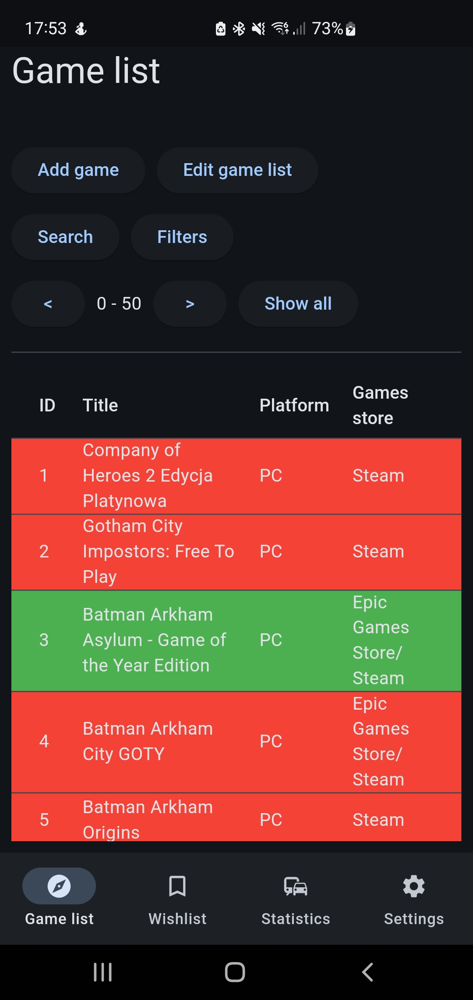

# Game Catalog

This project allows you to create a database of games you own and those you plan to purchase. The application uses an SQL database, facilitated by the SQLite library. The user interface is built with the Flet library. 

## Features

- **Game Database**: Easily add and manage a list of games you own or plan to buy.
- **SQL Database**: Utilizes SQLite to store and retrieve game data efficiently.
- **Statistics**: Generates basic statistics about your game collection, such as the number of games per platform or digital store.
- **Charts**: Visualize your game collection and statistics through generated charts.

## Technologies Used

- **SQLite**: Database management for storing game information.
- **Flet**: Library used to build the user interface.

## Usage

- **Add Games**: Add games to your collection by entering the title, platform and digital store information.
- **View Statistics**: See statistics based on your game collection, including breakdowns by platform and store.
- **Generate Charts**: Create visual representations of your collection data.

## Mobile App

